Who is this document for:

This guide is intended for marketplace owners and developers who wish to
trade NFT through their website.

To connect the marketplace to the Polkadot blockchain, you need a REST-
api (unique-SDK) to work with the Unique infrastructure (
[*https://github.com/UniqueNetwork/unique-sdk*](https://github.com/UniqueNetwork/unique-sdk)
).

You also need to familiarize yourself with the corresponding methods of
this library (
[*https://github.com/UniqueNetwork/unique-sdk/blob/develop/packages/web/README.md*](https://github.com/UniqueNetwork/unique-sdk/blob/develop/packages/web/README.md)
) .

Method examples are also available in Swagger (
*https://web-quartz.unique.network/swagger/\#/* ).

Separately, there is an api for loading images for NFT, from where we
will need one method:

[*https://image-uploader.unique.network/api/docs/*](https://image-uploader.unique.network/api/docs/)

How the market and blockchain work.

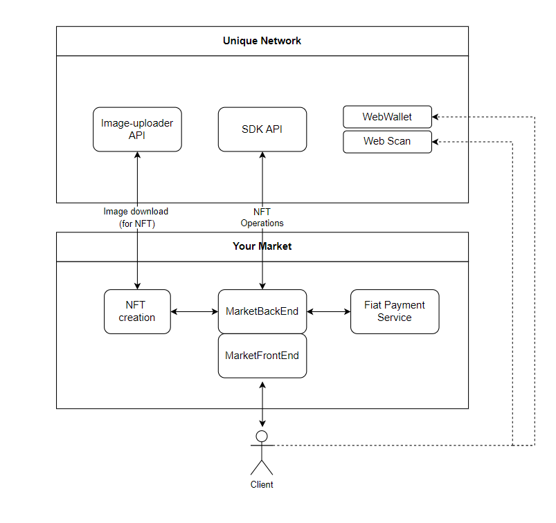

TABLE OF CONTENTS:

STEP 1

STEP 2

STEP 3

STEP 4

STEP 5

STEP 1.

To carry out transactions with NFT, it is necessary to have a
Polkadot\\Unique substrate address.

To do this, you need to use the resources:
[*https://polkadot.js.org*](https://polkadot.js.org) ,
[*https://wallet.unique.network/*](https://wallet.unique.network/) or
use the API:
[*https://polkadot.js.org/docs/ui-keyring/*](https://polkadot.js.org/docs/ui-keyring/)
.

First, consider creating a substrate address using
https://wallet.unique.network/ as an example:

STEP 1.1.

Go to [*https://wallet.unique.network/*](https://wallet.unique.network/)
and click on the "Create substrate account" button

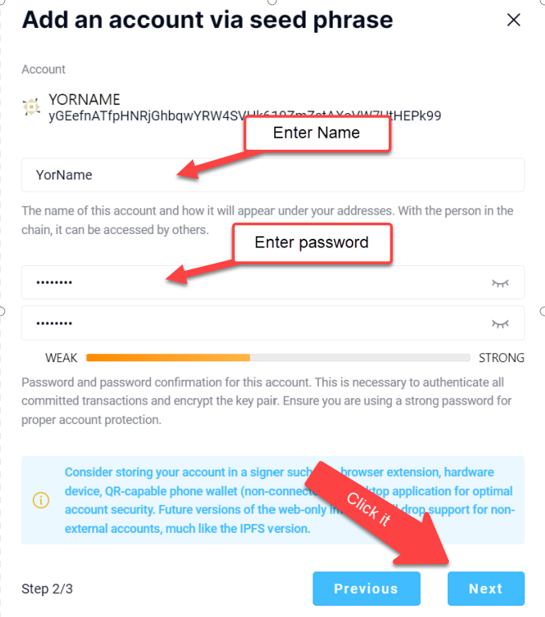

STEP 1.2.

When creating an account, the type "Mnemonic" is selected and a secret
phrase of 12 words is automatically generated.

You need to write down these words for yourself in a safe place and keep
them.

After that, mark the checkbox "I have saved my mnemonic seed safely" and
press the "NEXT" butto
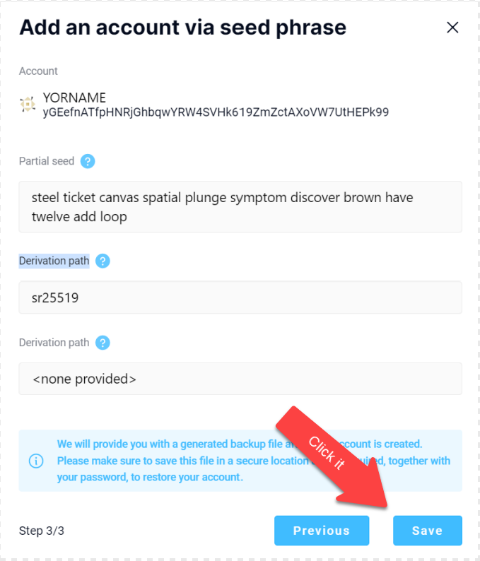

STEP 1.3.

Think up and enter your name and password. After that, the "NEXT" button
is pressed.

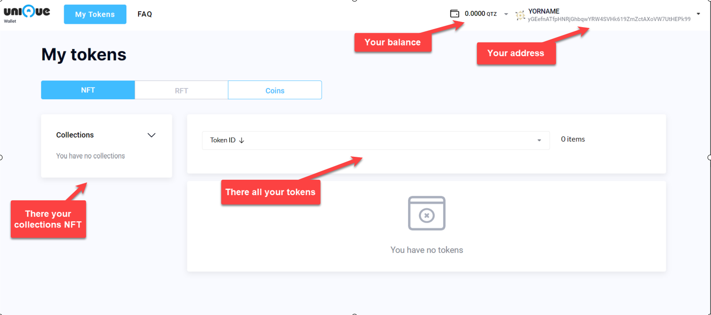

STEP 1.4.

Log in to your account using your credentials (credentials already
entered). Press the "SAVE"
button.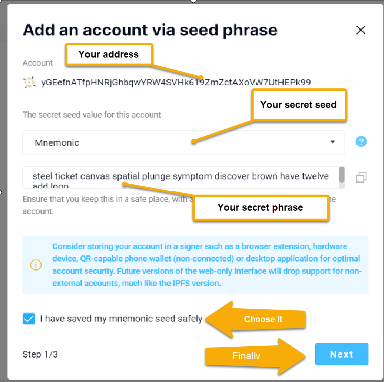

You now have your substrate address!


STEP 2.

The next stage of work will be the creation of a collection to
accommodate the NFT.

STEP 2.1.

To do this, using our authorization data, go to the minter at:
[*https://minter-quartz.unique.network/*](https://minter-quartz.unique.network/)
and click on the "Add account via" button

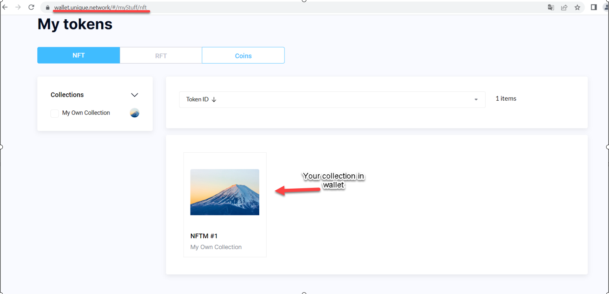
STEP 2.2.

On the page that opens, enter your secret phrase, select the checkbox
and press the "NEXT" button.

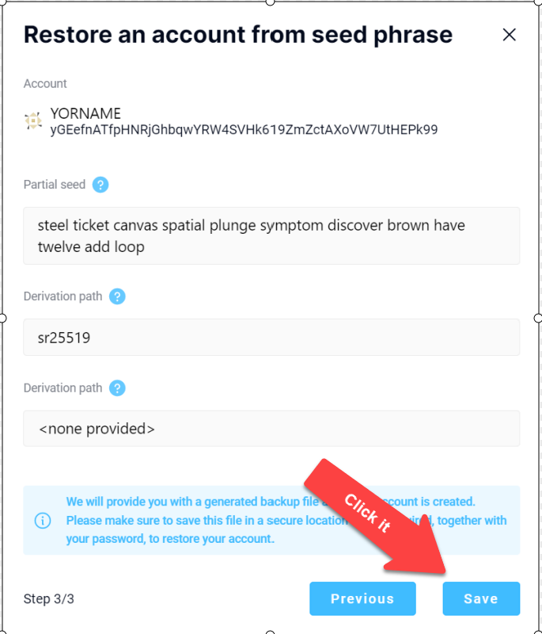

STEP 2.3.

Next, enter your account name and password. Press the "NEXT" button.

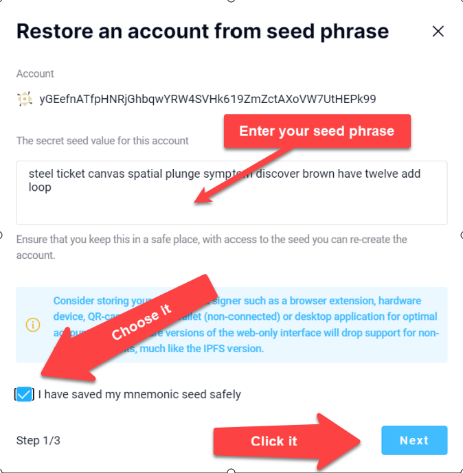
STEP 2.4.

A page with your details opens. Press the "SAVE" button.

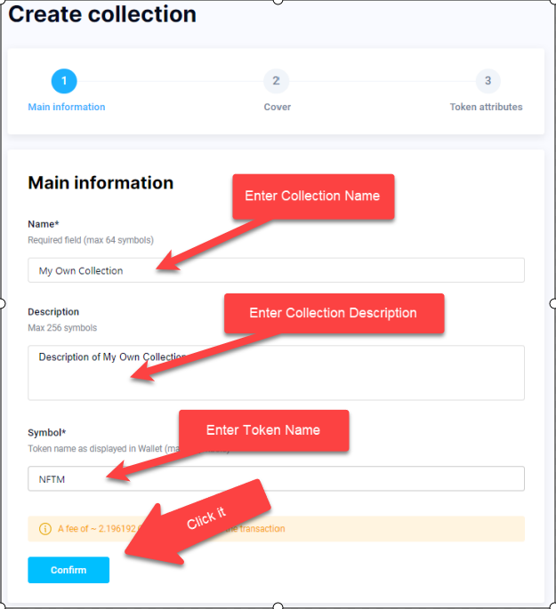

STEP 2.5.

Now you are authorized in the minter and can create NFT collections and
NFT tokens.

Attention! To create collections, you must have QTZ coins in your
account!

To get QTZ coins, you can request them using the bot:
[*https://t.me/unique2faucet\_opal\_bot*](https://t.me/unique2faucet_opal_bot)


To create a collection, click the "Create new" button.


STEP 2.6.

Next, you need to enter the name of your collection, a description of
the collection, and a short name for the collection tokens.

Press the "Confirm" button.

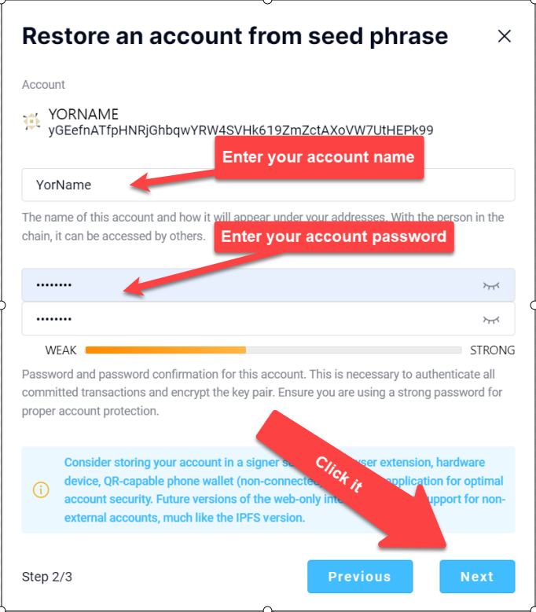

STEP 2.7.

Next, you need to load the collection icon.

Click on the "Confirm" button.


STEP 2.8.

Next, you need to set the names of the fields in future tokens and click
the "Confirm" button.


STEP 2.9.

Next, signing the transaction, you must enter your password and click
the "Sign and submit" button.

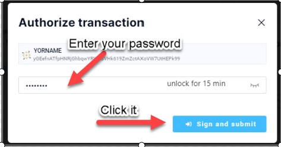

You need to wait about 1 minute. Then your collection will appear.

You are now the owner of an empty NFT collection!

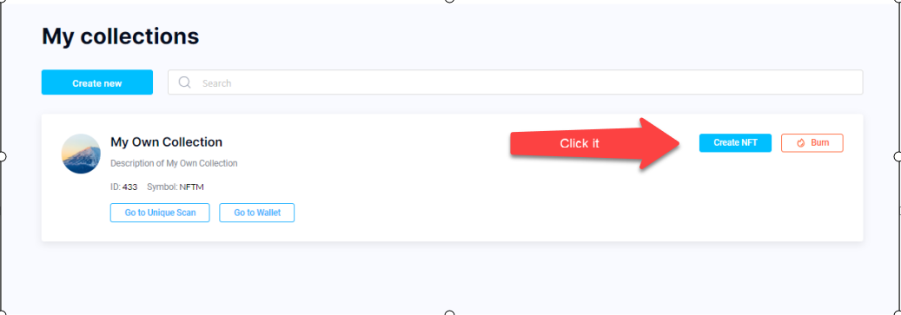

STEP 3.

Creation of the NFT token.

STEP 3.1.

To create an NFT token, you need to click on the “Create NFT” button.


STEP 3.2.

Next, you need to upload your NFT image, enter the name of the image and
click the "Confirm" button.

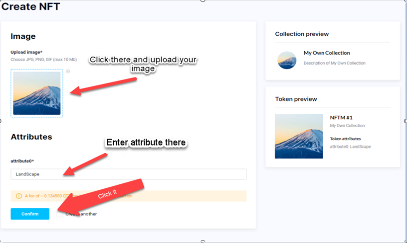

Then sign our transaction for the creation of the NFT, similar to step
2.8.

You now have your first NFT token, which can be seen here:


After that, our collection and the NFT token appear in our substrate
address:


It is now possible to connect NFT token trading to your marketplace.

To do this, we must use the swagger
https://web-quartz.unique.network/swagger/\#/ and as a guide to action -
the REST API documentation:
https://github.com/UniqueNetwork/unique-sdk/blob/
develop/packages/web/README.md .

You need to do the following:

STEP 4.

Creation and signing of an extrinsic.

For requests to change the status of a token in the blockchain, you must
use an extrinsic.

STEP 4.1.

To create an extrinsic, use PATCH /token for transfer NFT\
\
Request Body

```
{

"collectionId": 1,

"tokenId": 1,

"from": "string",

"to": "string"

}
```

CURL Example

```
curl -X 'PATCH' \\

'https://web-quartz.unique.network/token/transfer' \\

-H 'accept: application/json' \\

-H 'Content-Type: application/json' \\

-d '{

"collectionId": 1,

"tokenId": 1,

"from": "string",

"to": "string"

}'
```

Response

Http Status 200

```
{

"signerPayloadJSON": {

"address": "yGCyN3eydMkze4EPtz59Tn7obwbUbYNZCz48dp8FRdemTaLwm",

"blockHash": "string",

"blockNumber": "string",

"era": "string",

"genesisHash": "string",

"method": "string",

"nonce": "string",

"specVersion": "string",

"tip": "string",

"transactionVersion": "string",

"signedExtensions": \[

"string"

\],

"version": 0

},

"signerPayloadRaw": {

"address": "yGCyN3eydMkze4EPtz59Tn7obwbUbYNZCz48dp8FRdemTaLwm",

"data": "string",

"type": "bytes"

},

"signerPayloadHex": "string"

}
```

So we created the extrinsic.

STEP 4.2.

Signing extrinsic.

To sign an extrinsic, use the POST /extrinsic/sign method

Request body
```
{

"signerPayloadHex": "string"

}
```

CURL Example

```
curl -X 'POST' \\

'https://web-quartz.unique.network/extrinsic/sign' \\

-H 'accept: application/json' \\

-H 'Content-Type: application/json' \\

-d '{

"signerPayloadHex": "string"

}'
```

Response

Http Status 200

```
{

"signature": "string",

"signatureType": "sr25519"

}

Так мы подписали экстринзик.

STEP 4.3.

Confirm the extrinsic in the chain.

For this, the POST /extrinsic/submit method is used.

Request body

{

"signerPayloadJSON": {

"address": "yGCyN3eydMkze4EPtz59Tn7obwbUbYNZCz48dp8FRdemTaLwm",

"blockHash": "string",

"blockNumber": "string",

"era": "string",

"genesisHash": "string",

"method": "string",

"nonce": "string",

"specVersion": "string",

"tip": "string",

"transactionVersion": "string",

"signedExtensions": \[

"string"

\],

"version": 0

},

"signature": "string",

"signatureType": "sr25519"

}
```

CURL Example

```
curl -X 'POST' \\

'https://web-quartz.unique.network/extrinsic/submit' \\

-H 'accept: application/json' \\

-H 'Content-Type: application/json' \\

-d '{

"signerPayloadJSON": {

"address": "yGCyN3eydMkze4EPtz59Tn7obwbUbYNZCz48dp8FRdemTaLwm",

"blockHash": "string",

"blockNumber": "string",

"era": "string",

"genesisHash": "string",

"method": "string",

"nonce": "string",

"specVersion": "string",

"tip": "string",

"transactionVersion": "string",

"signedExtensions": \[

"string"

\],

"version": 0

},

"signature": "string",

"signatureType": "sr25519"

}'

Response

Http Status 200

{

"hash": "string"

}
```

STEP 5.

Now there is the possibility of transactions with NFT tokens.

To work with NFT tokens on the marketplace, the following interaction
scheme is offered:

(precondition – the marketplace client has a substrate address)

- The marketplace client wants to buy an NFT token of his physical
picture;

- He selects his painting and presses the "buy NFT" button (must exist);

- Next, the client pays for the NFT in fiat, upon receipt of payment,
the marketplace owner creates an NFT token on the blockchain and
transfers the ownership of the token to the buyer.

For this:

STEP 5.1.

Creation of NFT token (if you create NFT tokens in minter, you can skip
this step).

POST /token

Request body

```
{

"collectionId": 1,

"address": "yGCyN3eydMkze4EPtz59Tn7obwbUbYNZCz48dp8FRdemTaLwm",

"constData": {

"ipfsJson":
"{\\"ipfs\\":\\"QmS8YXgfGKgTUnjAPtEf3uf5k4YrFLP2uDcYuNyGLnEiNb\\",\\"type\\":\\"image\\"}",

"gender": "Male",

"traits": \[

"TEETH\_SMILE",

"UP\_HAIR"

\]

}

}

CURL Example

curl -X 'POST' \\

'https://web-quartz.unique.network/token' \\

-H 'accept: application/json' \\

-H 'Content-Type: application/json' \\

-d '{

"collectionId": 0,

"address": "string",

"constData": {}

}'
```

Response

Http Status 200
```
{

"signerPayloadJSON": {

"address": "yGCyN3eydMkze4EPtz59Tn7obwbUbYNZCz48dp8FRdemTaLwm",

"blockHash": "string",

"blockNumber": "string",

"era": "string",

"genesisHash": "string",

"method": "string",

"nonce": "string",

"specVersion": "string",

"tip": "string",

"transactionVersion": "string",

"signedExtensions": \[

"string"

\],

"version": 0

},

"signerPayloadRaw": {

"address": "yGCyN3eydMkze4EPtz59Tn7obwbUbYNZCz48dp8FRdemTaLwm",

"data": "string",

"type": "bytes"

},

"signerPayloadHex": "string"

}

Your token has been created!\
\
*After executing this method, you must follow method POST
/extrinsic/sign and method POST /extrinsic/submit*

STEP 5.2.

Transfer of ownership of the NFT token to the buyer.

PATCH /token

Request body

{

"collectionId": 1,

"tokenId": 1,

"from": "string",

"to": "string"

}

CURL Example

curl -X 'PATCH' \\

'https://web-quartz.unique.network/token/transfer' \\

-H 'accept: application/json' \\

-H 'Content-Type: application/json' \\

-d '{

"collectionId": 1,

"tokenId": 1,

"from": "string",

"to": "string"

}'
```

Response

Http Status 200

```
{

"signerPayloadJSON": {

"address": "yGCyN3eydMkze4EPtz59Tn7obwbUbYNZCz48dp8FRdemTaLwm",

"blockHash": "string",

"blockNumber": "string",

"era": "string",

"genesisHash": "string",

"method": "string",

"nonce": "string",

"specVersion": "string",

"tip": "string",

"transactionVersion": "string",

"signedExtensions": \[

"string"

\],

"version": 0

},

"signerPayloadRaw": {

"address": "yGCyN3eydMkze4EPtz59Tn7obwbUbYNZCz48dp8FRdemTaLwm",

"data": "string",

"type": "bytes"

},

"signerPayloadHex": "string"

}
```

*After executing this method, you must follow method POST
/extrinsic/sign and method POST /extrinsic/submit*

You have transferred the token to the client!

This is how you work with tokens on the marketplace.
